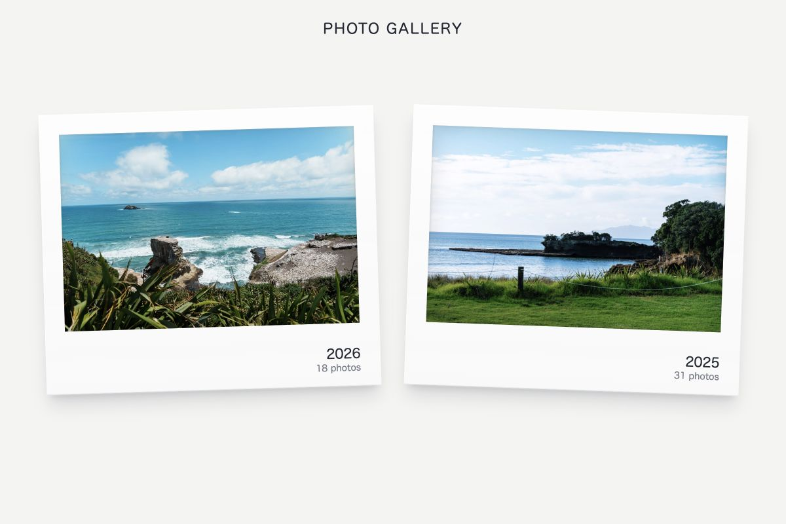
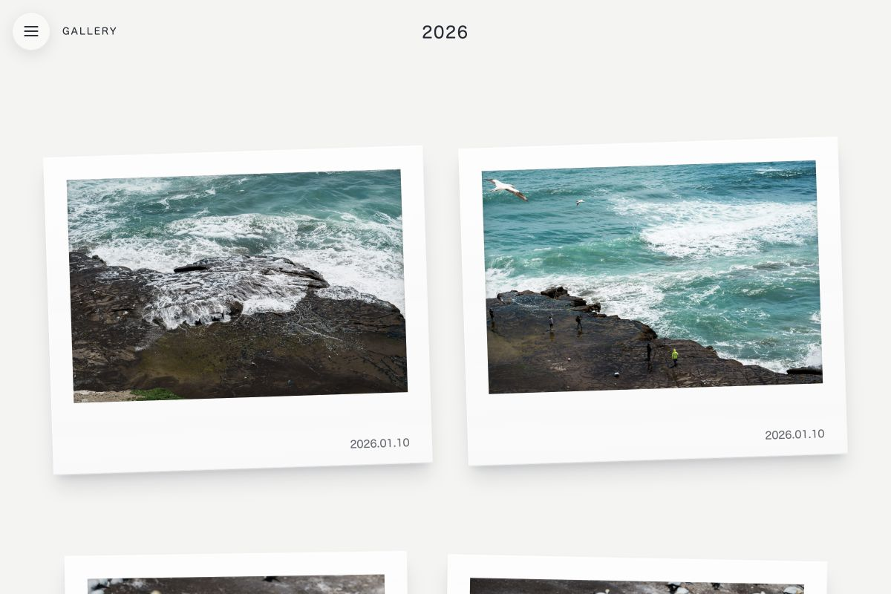
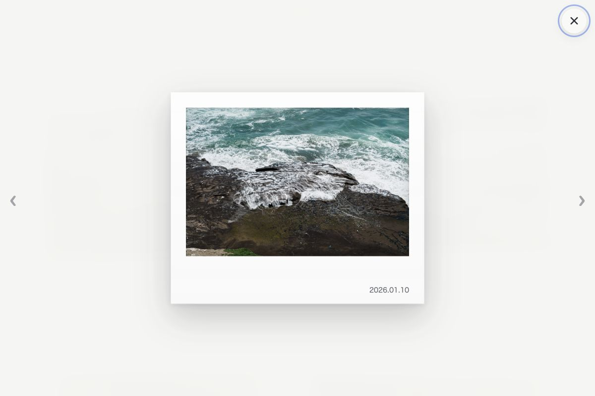

# Static Photo Gallery

A framework-free, build-time photo gallery for static hosting. Each direct child of `photos/` becomes an album; nested folders are scanned recursively.

## Screenshots

<p align="center">
  
  
  
</p>

```text
photos/
  2025/                              -> /2025
    2025-07-01/DSCF0033.JPG          -> part of /2025
  2026/                              -> /2026
    2026-01-10/DSC02553.jpg          -> part of /2026
```

## Build and preview

Requires Node.js 20.9 or newer.

```bash
npm install
npm run build
python3 -m http.server 8000 -d dist
```

Open `http://localhost:8000/` for the album index or a route such as `http://localhost:8000/2026`.

`npm run build` clears and recreates `dist/`. Do not edit it manually. For Cloudflare Pages, manually deploy `dist/` as the static output directory.

## Photos

- Supported formats: JPG, JPEG, PNG, WebP, GIF, and AVIF.
- The build converts still images to a single WebP with a maximum width or height of 2400px. GIF files are copied unchanged.
- Album folder names must start and end with a lowercase letter or number and may contain `-` or `_`. Photo filenames may contain spaces, Chinese, emoji, and special characters.
- Capture dates come from EXIF `DateTimeOriginal`, then `CreateDate`, then a valid nested path such as `2026/01/02/` or `2026-01-02/`.
- Standard order is oldest to newest; undated photos follow in natural relative-path order. Reverse shows the opposite order. Random is enabled by default.
- Camera and system names such as `IMG_1234`, `DSC_0042`, `PXL_...`, screenshots, UUIDs, and numeric timestamps are hidden automatically. Descriptive filenames remain visible.

## Album configuration

`gallery.config.json` optionally sets display titles and homepage order:

```json
{
  "order": ["2026", "2025"],
  "albums": {
    "2026": { "title": "2026" },
    "2025": { "title": "2025" }
  }
}
```

The folder name remains the URL. Albums without a configured title use their folder name. Albums omitted from `order` are appended in natural folder-name order. Invalid, unknown, or duplicate configuration entries fail the build.

The wall includes Random, Reverse, Show name, and Show time controls. Their values are saved in the current browser with `localStorage`. Photos open in a responsive keyboard-accessible lightbox.

## License

The source code is licensed under the [MIT License](LICENSE).

The photographs under `photos/` are not covered by the MIT License. See the separate [Photograph Rights Notice](PHOTOS_LICENSE.md); all rights to those photographs are reserved.
